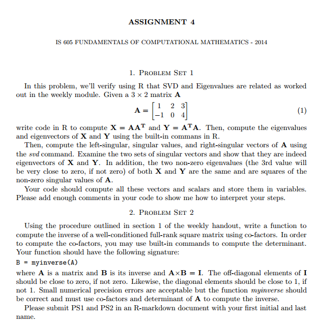

```{r setup, include=FALSE}
knitr::opts_chunk$set(echo = TRUE)
```




### Answer 1:

```{r}

A <- matrix(c(1,2,3,-1,0,4), 2, byrow=T)

X <- A %*% t(A)
X
Y <- t(A) %*% A
Y

# Calculate Eigen vectors & Eigen values of X and Y

eX <- eigen(X)
e_val_X <- eX$values
e_val_X
e_vec_X <- eX$vectors
e_vec_X

eY <- eigen(Y)
e_val_Y <- eY$values
e_val_Y
e_vec_Y <- eY$vectors
e_vec_Y

# Calculate Singular Values

sVal <- svd(A)
sVal

# Left Vectors (U) = Eigen Vectors of AA^T

e_vec_X[,1:2]
sVal$u

# Right Vectors(V) = Eigen Vectors of A^TA

sVal$v
e_vec_Y[,1:2]

# Singluar Values
sqrt(e_val_X)
sqrt(e_val_Y)
```


### Answer 2:

#### myinverse function

```{r}
myinverse <- function(A) {
  cFac <- diag (nrow(A))

  for (i in 1:nrow ( A )) {
    for (j in 1:ncol( A )) {
    cFac[i,j] <- ( det(A[(-1*i), (-1*j) ]) * ((-1)^(i+j) )  )

    }
  }
  T <- diag(nrow(A)) 

  for ( i in 1:nrow(A)) {
    row <- cFac[i,]
    for ( j in 1:length(row)) {
      T [ j,i ] <- row[j]
    }

  }
  inv <- 1/(det(A) ) * T
  inv
}
```

#### Testing function

```{r}
A <- matrix(c(3,2,1,2,1,3,1,1,3),nrow=3)

A %*% myinverse(A)
```

