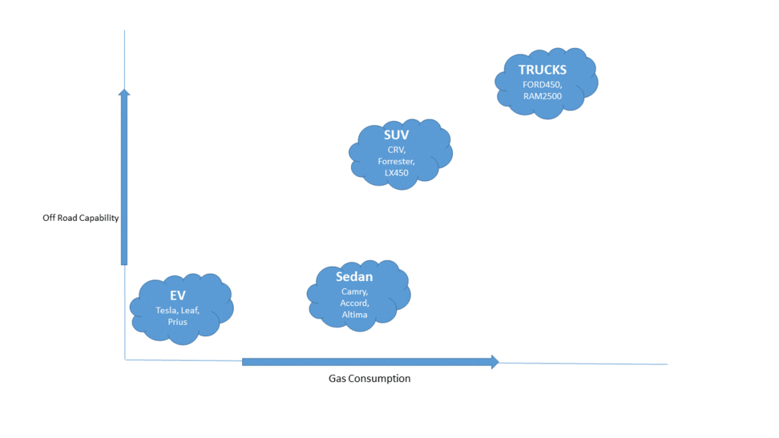

```{r setup, include=FALSE}
knitr::opts_chunk$set(echo = TRUE)
library(e1071) # SVM
library(FNN)  # Fast k-Nearest Neighbors (kNN)
library(RWeka) # IBk function used in kNN Model"
library(RColorBrewer)
library(rpart) # RPart
library(tree)
library(maptree)
library(ggplot2)
library(rattle)
library(rpart.plot)
library(plotly)
library(Rtsne)
```


## Digit Recognition

The purpose of the project is to read hand written digits. To do this I have used MNIST database. This database is also widely used for training and testing in the field of machine learning and for this project I have use three models (explained later).


### Load Data

I have used MNIST database and then divided the original database in 80:20 ratio. The 80% of data will be used for training the models and rest will be used for testing the model.


```{r warning=FALSE}
digit<- read.csv("mnist.csv")
nrow(digit)
digit <- digit[1:20000,]
# Divide data in 80:20 ratio - training:test
samp_size <-floor(0.80* nrow(digit))
train_ind <-sample(seq_len(nrow(digit)), size = samp_size)

# Training data
# train_set <- digit[train_ind,]
DATASET.train <- as.data.frame(digit[train_ind,])

# Test Data
# test_set  <-digit[-train_ind,]
DATASET.test <-  as.data.frame(digit[-train_ind,])

```

## Visualization

### MNIST images

Lets see what hand written images MNIST data set has

```{r}
flip <- function(matrix){
    apply(matrix, 2, rev)
}

par(mfrow=c(3,3))
for (i in 1:28){
    dit <- flip(matrix(rev(as.numeric(DATASET.train[i,-c(1, 786)])), nrow = 28)) #look at one digit
    image(dit, col = grey.colors(255))
}
```


### Visualising MNIST Dataset using t-SNE

t-SNE stands for t-Distributed Stochastic Neighbor Embedding. It visualizes high-dimensional data by giving each data point a location in a two or three-dimensional map. It is a variation of Stochastic Neighbor Embedding that allows optimization, and produces significantly better visualizations by reducing the tendency to lump points together in the center of the map that often renders the visualization ineffective and unreadable. Since it visualizes high-dimensional data, it is one of the best technique to visualize a large data set such as MNIST.

```{r warning=FALSE}
tsne <- Rtsne(as.matrix(DATASET.test), check_duplicates = TRUE, pca = TRUE, perplexity = 30, theta = 0.5, dims = 2)

```
```{r echo=FALSE}
# plot the output 
matsne <- data.frame(DATASET.test$X5)
#population[order(population$age),]
filePlot <- paste("plots/tsne_MNIST",".png", sep = "")
png(filePlot, width = 1200, height = 900)
plot(tsne$Y,  col=brewer.pal(10,"Set3"),
     cex=0.75, cex.axis=1.25, cex.lab=1.25, cex.main=1.5,
     xlab = "t-SNE clustering of 0-9",
     main = "2D t-SNE clustering of MNIST dataset"
     )
legend('topright', legend = c(unique(matsne$DATASET.test.X5)) , lty=1, col=brewer.pal(10,"Set3"), bty='n', cex=.75)
```

tSNE:  

### Training and Test Data Set

#### Training Data Set

Lets visualize the training data using a Bar Plot. This will give us an idea of frequency of each digits in the DATASET.training data frame.


```{r warning=FALSE}
 barplot(table(DATASET.train$X5), main="Total Number of Digits (Training Set)", col=brewer.pal(10,"Set3"),
  	xlab="Numbers", ylab = "Frequency of Numbers")

```

#### Test Data Set
 
 The ratio of digits in test data set is very similar to that of training data set, as seen below.

```{r warning=FALSE}
 barplot(table(DATASET.test$X5), main="Total Number of Digits (Test Set)", col=brewer.pal(10,"Set2"),
  	xlab="Numbers", ylab = "Frequency of Numbers")

```

## Models

For this project I'll be using three Models namely :

1. RPart
2. kNN
2. FNN

## RPart

RPart or **R**ecursive **PART**itioning build classification or regression models of a very general structure using a two stage procedure (described below), the resulting models can be represented as binary trees. It is very important to understand how a decision tree works in RPart. Consider a case of 168 cardiac arrest patients.The goal is to predict which patients can be successfully revived in the field. The resultant model separated the patients into **four groups** as shown below, where

X1 = initial heart rhythm
**1= VF/VT 2=EMD 3=Asystole 4=Other**

X2 = initial response to defibrillator
1=Improved 2=No change 3=Worse

X3 = initial response to drugs
1=Improved 2=No change 3=Worse

RPart decision tree:  


As seen above, the tree is built by the following process: first the single variable is found which best splits the data into two groups. The data is separated, and then this process is applied separately to each sub-group, and so on recursively until the subgroups either reach a minimum size or until no improvement can be made.

For in depth understanding of RPart, please follow the below link
[An Introduction to Recursive Partitioning](https://cran.r-project.org/web/packages/rpart/vignettes/longintro.pdf)


### Model creation

Lets create a model based on RPart Algorithm. The first argument of the function is a model formula, with the ~ symbol standing for "is modeled as". Since we are dealing with categorical data (0-9), we will give method as "class" signifying classification. The Proc.time function will give us the time and CPU resource consumed in building this model. We should take note of Elapsed Time which will tell us the actual duration consumed in building this model.

```{r warning=FALSE}
pc <- proc.time()
model.rpart <- rpart(DATASET.train$X5 ~ .,method = "class", data = DATASET.train)
proc.time() - pc
```
```{r}
printcp(model.rpart)
```
```{r warning=FALSE}
prp(model.rpart, extra=6, main="Classification (RPART). Tree of Handwritten Digit Recognition ",
box.col=brewer.pal(10,"Set3")[model.rpart$frame$yval])
```

```{r}
draw.tree(model.rpart, cex = 0.52, nodeinfo = TRUE, col = gray(0:8/8))
```

```{r}
heat.tree <- function(tree, low.is.green=FALSE, ...) { # dots args passed to prp
y <- model.rpart$frame$yval
if(low.is.green)
y <- -y
max <- max(y)
min <- min(y)
cols <- rainbow(99, end=.36)[
ifelse(y > y[1], (y-y[1]) * (99-50) / (max-y[1]) + 50,
(y-min) * (50-1) / (y[1]-min) + 1)]
prp(model.rpart, branch.col=brewer.pal(10,"Set3"), box.col=brewer.pal(10,"Set3"), ...)
}

heat.tree(model.rpart, type=4, varlen=0, faclen=0, fallen.leaves=TRUE)
```


### Confusion Matrix - RPart

The confusion Matrix will give us the idea of how precise and accurate our Model was for each digit.

```{r warning=FALSE}
prediction.rpart <- predict(model.rpart, newdata = DATASET.test, type = "class")
table(`Actual Class` = DATASET.test$X5, `Predicted Class` = prediction.rpart)
```

### Prediction Accuracy

Lets find out the overall prediction accuracy of our model.

```{r}
error.rate.rpart <- sum(DATASET.test$X5 != prediction.rpart)/nrow(DATASET.test)
accuracy <- round((1 - error.rate.rpart) *100,2)
print(paste0("Prediction Accuracy: ", accuracy))
```

### Predict Digit for RPart

```{r warning=FALSE}
row <- 1
prediction.digit <- as.vector(predict(model.rpart, newdata = DATASET.test[row, ], type = "class"))
print(paste0("Current Digit: ", as.character(DATASET.test$X5[row])))
```
```{r warning=FALSE}
print(paste0("Predicted Digit: ", prediction.digit))
```


## kNN

kNN stands for **k - nearest neighbor**. This is one of my favorite model because of the fact that its simplest amongst all. Imagine you need to classify a vehicle based on parameters such as off road capability and gas consumption. Assume you already have four groups - EV, SUV, Sedans and Trucks. Now if you have to classify Toyota Rav4 Hybrid for  k = 3, you need to see the nearest three neighbors and then as per the animation below, you will find SUV nearest to Rav4 and hence it can be classified as SUV.

kNN classification: 

The above is an oversimplification of kNN, kNN  is an non parametric lazy learning algorithm and by non parametric I mean that it does not make any assumptions on the underlying data distribution i.e. it has no bias.


### Model creation

```{r warning=FALSE}
pc <- proc.time()
model.knn <- IBk(DATASET.train$X5 ~ ., data = DATASET.train)
proc.time() - pc
```

### Confusion Matrix - (kNN)

The confusion Matrix will give us the idea of how precise and accurate our Model was for each digit.

```{r warning=FALSE}
prediction.knn <- predict(model.knn, newdata = DATASET.test, type = "class")
table(`Actual Class` = DATASET.test$X5, `Predicted Class` = prediction.knn)
```


### Prediction Accuracy

Lets find out the overall prediction accuracy of our model.

```{r warning=FALSE}
error.rate.knn <- sum(DATASET.test$X5 != prediction.knn)/nrow(DATASET.test)
accuracy <- round((1 - error.rate.knn) *100,2)
print(paste0("Prediction Accuracy: ", accuracy))
```


### Predict Digit for kNN

```{r warning=FALSE}
row <- 1
prediction.digit <- as.vector(predict(model.knn, newdata = DATASET.test[row,  ], type = "class"))
print(paste0("Current Digit: ", as.character(DATASET.test$X5[row])))
print(paste0("Predicted Digit: ", prediction.digit))
```


## FNN

FNN stands for Fast Nearest Neighbor. As you may have guessed it by now FNN belongs to the same family of Models to which k-NN belongs i.e. Nearest neighbor search. What is Random Forest to Rpart or other decision tree based algorithms, FNN is to k-NN.In applications areas, such as in digit recognition, recommendation systems and computer vision, where fast response times are critical, using brute force linear search is often not feasible and it areas such as these where FNN shines.

For detailed understanding of Fast Nearest Neighbor, please refer to the following link

[Fast k-NN Search](https://arxiv.org/pdf/1509.06957.pdf)

### Model creation


```{r warning=FALSE}
pc <- proc.time()
model.FNN <- FNN::knn(DATASET.train[, -1], DATASET.test[, -1], DATASET.train$X5,  k = 10, algorithm = "cover_tree")
proc.time() - pc
```

### Confusion Matrix - (fNN)

The confusion Matrix will give us the idea of how precise and accurate our Model was for each digit.

```{r warning=FALSE}
table(`Actual Class` = DATASET.test$X5, `Predicted Class` = model.FNN)
```


### Prediction Accuracy

Lets find out the overall prediction accuracy of our model.


```{r warning=FALSE}
error.rate.fnn <- sum(DATASET.test$X5 != model.FNN)/nrow(DATASET.test)
accuracy <- round((1 - error.rate.fnn) *100,2)
print(paste0("Prediction Accuracy: ", accuracy))
```


### Predict Digit for fNN

```{r warning=FALSE}
row <- 1
prediction.digit <- model.FNN[row]
print(paste0("Current Digit: ", as.character(DATASET.test$X5[row])))
print(paste0("Predicted Digit: ", prediction.digit))
```


## Conclusion

After several runs and comparing all the three models, the Nearest Neighbor models appear to be superior to Rpart- tree based model. Both kNN and FNN repeatedly returned with above 95% Accuracy (which can also be the case of Model over fitting). The choice between kNN and FNN is rather not that difficult since kNN took comparatively greater time to run than FNN, and hence my Model of choice for Digit Recognition has to be FNN.