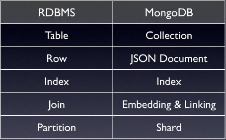

## Project 4 : NoSQL Migration

For this assignment I have used MySQL as RDBMS database and MongoDB as NoSQLdatabase. I would be migrating tables in **Flights** schema from MySQL to MongoDB.
For this assignment, I did refer to the following two blogs:

1. [Accessing MongoDB from R with mongolite](http://tillbergmann.com/blog/mongodb-in-r.html)
2. [How to start MongoDB from Windows](http://stackoverflow.com/questions/20796714/what-is-the-way-to-start-mongo-db-from-windows-7-64-bit) 

```{r setup, include=FALSE}
knitr::opts_chunk$set(echo = TRUE)
library(jsonlite)
library(RMySQL)
library(dbConnect)
library(mongolite)
```


## Whats is MongoDB

MongoDB is an open-source noSQL database which stores data in JSON-like documents (BSON) that can vary in structure. Related information is stored together for fast query access through the MongoDB query language. MongoDB uses dynamic schemas, meaning that you can create records without first defining the structure, such as the fields or the types of their values.

## RDBMS vs NoSQL(MongoDB)



MySQL as a relation database which requires a strict schema for its data model andall tables should be created with explicit columns defination. In comparison, MongoDB does not impose any schema restrcition on the documents being stored in the collection. It becomes the responsibility of application to deal with that, the only thing MongoDB restricts is the supported data types. It significantly speeds up the development process as MongoDB could be used right away to store JSON documents of any shape.

## Extract data from MySQL

For extrtacting data from MySQL , I am using RMySQL and DBConnect libraries. Below you can see the list of tables under Flights schema in MySQL.

```{r cars}
mydb = dbConnect(MySQL(), user='root', password ='admin', dbname='flights', host='localhost')
dbListTables(mydb)
```

## NoSQL DB

For using MongoDB within RStudio, I am using **Mongolite** library. Please note that if you are using a windows environment (OS), you need to create a directory /data/db and make it writable (use C:/data/db on Windows). Below we will migrate each table listed above to MongoDB database.

### Airlines

Migrate Airlines data to MongoDB.

```{r pressure, echo=FALSE}
Airlines <- dbGetQuery(mydb, "SELECT * FROM Airlines;")
nrow(Airlines)

noSQLDB <- mongo(collection = "Flights")
noSQLDB$insert(Airlines)
noSQLDB$count()
```

### Airport

Migrate Airport data to MongoDB.

```{r}
Airports <- dbGetQuery(mydb, "SELECT * FROM Airports;")
nrow(Airports)
noSQLDB$insert(Airports)

```


### Flights

Migrate Flights data to MongoDB.

```{r}
Flights <- dbGetQuery(mydb, "SELECT * FROM Flights;")
nrow(Flights)
noSQLDB$insert(Flights)

```

### Planes

Migrate Planes data to MongoDB.

```{r}
Planes <- dbGetQuery(mydb, "SELECT * FROM Planes;")
nrow(Planes)
noSQLDB$insert(Planes)

```

### Weather

Migrate Weather data to MongoDB. Since this is the last table that we need to migrate to MongoDB, we need to close MySQL connection once the migration is completed.

```{r}
Weather <- dbGetQuery(mydb, "SELECT * FROM Weather;")
nrow(Weather)
noSQLDB$insert(Weather)
# Disconnect from the database
dbDisconnect(mydb)
```

