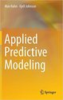
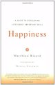

```{r setup, include=FALSE}
knitr::opts_chunk$set(echo = TRUE)
library(jsonlite)
library(XML)
library(htmltab)
library(knitr)
```


## Working with XML and JSON in R

Pick three of your favorite books on one of your favorite subjects. At least one of the books should have more
than one author. For each book, include the title, authors, and two or three other attributes that you find
interesting.
Take the information that you've selected about these three books, and separately create three files which
store the book's information in HTML (using an html table), XML, and JSON formats (e.g. "books.html",
"books.xml", and "books.json").

### Working with JSON

I have use **JSONLITE** library to read and parse data in JSON.

```{r warning=FALSE}
json_file <- "C:/data/book.json"
json_data <- fromJSON(paste(readLines(json_file), collapse=""))
jsonDF <- data.frame(json_data)
for (i in 1:3) {
  url <- rep(jsonDF$Amazon[i], 1)
  jsonDF$Amazon[i] <- paste0("[", "AmazonURL", "](", url, ")")
   if (i==1) {
    image <- paste0("[](", jsonDF$Image[i], ")") 
    jsonDF$Image[1] <- sprintf(image)
  } else if (i==2) {
    image <- paste0("[](", jsonDF$Image[i], ")")
    jsonDF$Image[2] <- sprintf(image)
  } else if (i==3) {
    image <- paste0("[](", jsonDF$Image[i], ")")
    jsonDF$Image[3] <- sprintf("")
  } 
}
kable(jsonDF)
```


### Working with XML

For XML, I have used **XML** library to read and parse data in XML. 

```{r warning=FALSE}
rawXML <- xmlParse("C:/data/book.xml")
xmlDF <- xmlToDataFrame(rawXML)
rXML <- xmlToList(rawXML)
xmlDF$Amazon <- NULL
xmlDF$Image <- NULL
for (i in 1:nrow(xmlDF)) {
  if (i==1) {
    url <- rXML$Book1$Image
    xmlDF$Amazon[i] <- paste0("[", "AmazonURL", "](", url, ")")
    image <- paste0("[](", url, ")") 
    xmlDF$Image[1] <- sprintf(image)
  } else if (i==2) {
    url <- rXML$Book2$Image
    xmlDF$Amazon[i] <- paste0("[", "AmazonURL", "](", url, ")")
    image <- paste0("[](", url, ")")
    xmlDF$Image[2] <- sprintf(image)
  } else if (i==3) {
    url <- rXML$Book3$Image
    xmlDF$Amazon[i] <- paste0("[", "AmazonURL", "](", url, ")")
    image <- paste0("[](", xmlDF$Image[i], ")")
    xmlDF$Image[3] <- sprintf("")
  } 
}
kable(xmlDF)
```


### Working with HTML

For extraxting data from table  tag from HTML document, I have used **HTMLTAB** library.

```{r warning=FALSE}
html_data <- htmltab(doc = "C:/data/book.html")
for (i in 1:3) {
  url <- rep(html_data$Amazon[i], 1)
  html_data$Amazon[i] <- paste0("[", "AmazonURL", "](", url, ")")
  if (i==1) {
    image <- paste0("[](", html_data$Image[i], ")") 
    html_data$Image[1] <- sprintf(image)
  } else if (i==2) {
    image <- paste0("[](", html_data$Image[i], ")")
    html_data$Image[2] <- sprintf(image)
  } else if (i==3) {
    image <- paste0("[](", html_data$Image[i], ")")
    html_data$Image[3] <- sprintf("")
  } 
}
kable(html_data)
```

