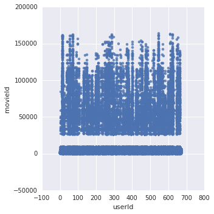
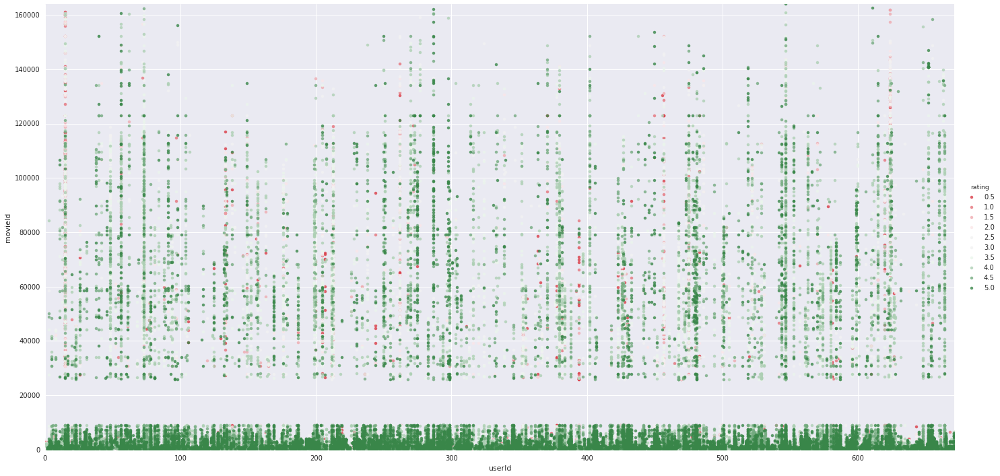
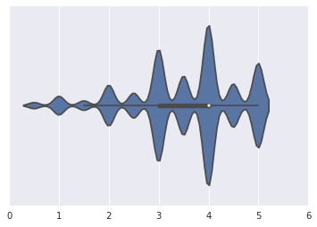

```python
# Load IBM Bluemix credentials

import ibmos2spark

# @hidden_cell
credentials = {
    'auth_url': 'https://identity.open.softlayer.com',
    'project_id': '2eab3fcff39c468496d7d4c2dd86d798',
    'region': 'dallas',
    'user_id': 'e3b7f91fcbb94678805fbede6ce54460',
    'username': 'member_e107debcb610addfb787978264dd6e485d686f6e',
    'password': 'GU1MD.GC&n7!*GaH'
}

configuration_name = 'os_5f6d4aa6639d432593151f543fd69086_configs'
bmos = ibmos2spark.bluemix(sc, credentials, configuration_name)

from pyspark.sql import SparkSession
spark = SparkSession.builder.getOrCreate()
df_data_1 = spark.read\
  .format('org.apache.spark.sql.execution.datasources.csv.CSVFileFormat')\
  .option('header', 'true')\
  .load(bmos.url('DefaultProjectdhananjaykumarspsmailcunyedu', 'movies.csv'))
df_data_1.take(5)


```


    [Row(MovieID=u'1', Title=u'Titanic', Genres=u'Romance'),
     Row(MovieID=u'2', Title=u'Inception', Genres=u'Thriller'),
     Row(MovieID=u'3', Title=u'Toy Story', Genres=u'Animaton'),
     Row(MovieID=u'4', Title=u'Jumanji', Genres=u'Comedy'),
     Row(MovieID=u'5', Title=u'Pink Panther', Genres=u'Comedy')]


## Spark machine learning library
[Apache Spark’s machine learning library](http://spark.apache.org/docs/latest/ml-guide.html) makes practical machine learning scalable and easy. The library consists of common machine learning algorithms and utilities, including classification, regression, clustering, collaborative filtering (this notebook!), dimensionality reduction, lower-level optimization primitives, and higher-level pipeline APIs.

The library has two packages:
- `spark.mllib` contains the original API that handles data in RDDs. 
- `spark.ml` contains a newer API for constructing ML pipelines. It handles data in DataFrames. 

I have used `spark.ml` package in this notebook.

### 1.1 Load movies.csv
To load the movies.csv file into a Spark DataFrame:


```python
# Click here to create your DataFrame
from pyspark.sql import SparkSession

# @hidden_cell

def set_hadoop_config_with_credentials_2a91b8b1599e40bfa11561a8b663b9ac(name):
    """This function sets the Hadoop configuration so it is possible to
    access data from Bluemix Object Storage using Spark"""

    prefix = 'fs.swift.service.' + name
    hconf = sc._jsc.hadoopConfiguration()
    hconf.set(prefix + '.auth.url', 'https://identity.open.softlayer.com'+'/v3/auth/tokens')
    hconf.set(prefix + '.auth.endpoint.prefix', 'endpoints')
    hconf.set(prefix + '.tenant', 'd49853da350f47ac85559bb77fabad12')
    hconf.set(prefix + '.username', '99ce50c0fb104e9d819bb8eed63c7cb4')
    hconf.set(prefix + '.password', 'xXr1{.K)Bhs9S.tZ')
    hconf.setInt(prefix + '.http.port', 8080)
    hconf.set(prefix + '.region', 'dallas')
    hconf.setBoolean(prefix + '.public', False)

# you can choose any name
name = 'keystone'
set_hadoop_config_with_credentials_2a91b8b1599e40bfa11561a8b663b9ac(name)

spark = SparkSession.builder.getOrCreate()

movies = spark.read\
  .format('org.apache.spark.sql.execution.datasources.csv.CSVFileFormat')\
  .option('header', 'true')\
  .load('swift://movielensnotebook.' + name + '/movies.csv')
movies.take(5)
```


    [Row(movieId=u'1', title=u'Toy Story (1995)', genres=u'Adventure|Animation|Children|Comedy|Fantasy'),
     Row(movieId=u'2', title=u'Jumanji (1995)', genres=u'Adventure|Children|Fantasy'),
     Row(movieId=u'3', title=u'Grumpier Old Men (1995)', genres=u'Comedy|Romance'),
     Row(movieId=u'4', title=u'Waiting to Exhale (1995)', genres=u'Comedy|Drama|Romance'),
     Row(movieId=u'5', title=u'Father of the Bride Part II (1995)', genres=u'Comedy')]


 The URI `swift://<container_name>.<keystone>/<file_name>` gives access to our data repository:

- `<keystone>` = the connection parameters (username, password, API endpoint, and so on), defined with the `set_hadoop_config_...` function.
- `<container_name>` = the container where you store the data, which was defined when you created your project. You can see the container name in the **Storage** section on the project **Settings** page. The default name is the name of your project without spaces. 
- `<file_name>` = the name of the file to access.


```python
container_name = 'movielensnotebook' 
movies_file_name = 'movies.csv'
ratings_file_name = 'ratings.csv'
```

### 1.2 Load ratings.csv

Now load the `ratings.csv` file. 


```python
ratings = spark.read\
  .format('org.apache.spark.sql.execution.datasources.csv.CSVFileFormat')\
  .option('header', 'true')\
  .load('swift://' + container_name + '.' + name + '/' + ratings_file_name)
ratings.take(5)
```


    [Row(userId=u'1', movieId=u'31', rating=u'2.5', timestamp=u'1260759144'),
     Row(userId=u'1', movieId=u'1029', rating=u'3.0', timestamp=u'1260759179'),
     Row(userId=u'1', movieId=u'1061', rating=u'3.0', timestamp=u'1260759182'),
     Row(userId=u'1', movieId=u'1129', rating=u'2.0', timestamp=u'1260759185'),
     Row(userId=u'1', movieId=u'1172', rating=u'4.0', timestamp=u'1260759205')]


## 2. Spark 
 

Let see the Spark version:


```python
print spark.version
```

    2.0.2


Spark DataFrames are distributed collections across a cluster of Spark executors. One of the key factors for ensuring that a Spark job is well distributed across the cluster is the number of partitions for a DataFrame. Run the `getNumPartitions()` method to show the number of partitions for each DataFrame: 


```python
print "Number of partitions for the movies DataFrame: " + str(movies.rdd.getNumPartitions())
print "Number of partitions for the ratings DataFrame: " + str(ratings.rdd.getNumPartitions())
```

    Number of partitions for the movies DataFrame: 1
    Number of partitions for the ratings DataFrame: 1


Despite the `defaultParallelism`, the Spark DataFrameReader that we used only used a single Spark partition, which means all subsequent Spark operations would only run on a single executor.

We can run the `repartition()` method to redistribute the ratings data across multiple partitions. But be aware that repartition can involve a great deal of network bandwidth while data is transfered across the cluster! Because Spark DataFrames are immutable, you have to create a new DataFrame to repartition an existing DataFrame.

Create the `repartitionedRatings` DataFrame across 10 partitions:


```python
repartitionedRatings = ratings.repartition(10)
print "Number of partitions for the ratings DataFrame: " + str(ratings.rdd.getNumPartitions())
print "Number of partitions for the repartitionedRatings DataFrame: " + str(repartitionedRatings.rdd.getNumPartitions())
```

    Number of partitions for the ratings DataFrame: 1
    Number of partitions for the repartitionedRatings DataFrame: 10


One of the key feature of Apache Spark is to leverage the memory as much as possible. While an action is in progress, data is loaded to memory and transformed several times before getting a result. But at the end of the processing, the memory is released. We can use the `.cache()` method to retain and persist a data set in memory as soon as we run an action on it. 

Load the `movies` and `ratings` data sets in memory to improve performance:


```python
print "Number of ratings: " + str(repartitionedRatings.count())
```

    Number of ratings: 100004


```python
repartitionedRatings.cache()
```


    DataFrame[userId: string, movieId: string, rating: string, timestamp: string]


When we run the next cell, `count()` is the first **action** performed on the `repartitionedRatings` DataFrame since it was cached. Thus, the data is read from object storage, the `repartition()` **transformation** is applied, and the `count()` action is run. But because we ran the `cache()` **transformation** on this DataFrame already, Spark won't release the memory.


```python
print "Number of ratings: " + str(repartitionedRatings.count())
```

    Number of ratings: 100004


## 3. Explore the data with Spark APIs
 

Show the content of the DataFrame in a table: 


```python
movies.show(truncate=False)
```

    +-------+-------------------------------------+-------------------------------------------+
    |movieId|title                                |genres                                     |
    +-------+-------------------------------------+-------------------------------------------+
    |1      |Toy Story (1995)                     |Adventure|Animation|Children|Comedy|Fantasy|
    |2      |Jumanji (1995)                       |Adventure|Children|Fantasy                 |
    |3      |Grumpier Old Men (1995)              |Comedy|Romance                             |
    |4      |Waiting to Exhale (1995)             |Comedy|Drama|Romance                       |
    |5      |Father of the Bride Part II (1995)   |Comedy                                     |
    |6      |Heat (1995)                          |Action|Crime|Thriller                      |
    |7      |Sabrina (1995)                       |Comedy|Romance                             |
    |8      |Tom and Huck (1995)                  |Adventure|Children                         |
    |9      |Sudden Death (1995)                  |Action                                     |
    |10     |GoldenEye (1995)                     |Action|Adventure|Thriller                  |
    |11     |American President, The (1995)       |Comedy|Drama|Romance                       |
    |12     |Dracula: Dead and Loving It (1995)   |Comedy|Horror                              |
    |13     |Balto (1995)                         |Adventure|Animation|Children               |
    |14     |Nixon (1995)                         |Drama                                      |
    |15     |Cutthroat Island (1995)              |Action|Adventure|Romance                   |
    |16     |Casino (1995)                        |Crime|Drama                                |
    |17     |Sense and Sensibility (1995)         |Drama|Romance                              |
    |18     |Four Rooms (1995)                    |Comedy                                     |
    |19     |Ace Ventura: When Nature Calls (1995)|Comedy                                     |
    |20     |Money Train (1995)                   |Action|Comedy|Crime|Drama|Thriller         |
    +-------+-------------------------------------+-------------------------------------------+
    only showing top 20 rows
    


Print the schema of the DataFrame:


```python
movies.printSchema()
```

    root
     |-- movieId: string (nullable = true)
     |-- title: string (nullable = true)
     |-- genres: string (nullable = true)
    


By default, the schema shows every column as a string. To override this, we can either explicitly specify the schema or configure the `inferSchema` parameter in the Spark CSV DataFrameReader.  

Set the `inferSchema` parameter and then print the schemas:


```python
movies = spark.read.csv('swift://' + container_name + '.' + name + '/' + movies_file_name, header=True, inferSchema=True).repartition(10).cache()
ratings = spark.read.csv('swift://' + container_name + '.' + name + '/' + ratings_file_name, header=True, inferSchema=True).repartition(10).cache()
```


```python
movies.printSchema()
ratings.printSchema()
```

    root
     |-- movieId: integer (nullable = true)
     |-- title: string (nullable = true)
     |-- genres: string (nullable = true)
    
    root
     |-- userId: integer (nullable = true)
     |-- movieId: integer (nullable = true)
     |-- rating: double (nullable = true)
     |-- timestamp: integer (nullable = true)
    


Run the `describe()` method to see the count, mean, standard deviation, minimum, and maximum values for the data in each column:


```python
ratings.describe().show()
```

    +-------+------------------+------------------+------------------+--------------------+
    |summary|            userId|           movieId|            rating|           timestamp|
    +-------+------------------+------------------+------------------+--------------------+
    |  count|            100004|            100004|            100004|              100004|
    |   mean| 347.0113095476181|12548.664363425463| 3.543608255669773|1.1296390869392424E9|
    | stddev|195.16383797819563|26369.198968815235|1.0580641091070384| 1.916858260271095E8|
    |    min|                 1|                 1|               0.5|           789652009|
    |    max|               671|            163949|               5.0|          1476640644|
    +-------+------------------+------------------+------------------+--------------------+
    


```python
print "Number of different users: " + str(ratings.select('userId').distinct().count())
print "Number of different movies: " + str(ratings.select('movieId').distinct().count())
print "Number of movies with at least one rating strictly higher than 4: " + str(ratings.filter('rating > 4').select('movieId').distinct().count())
```

    Number of different users: 671
    Number of different movies: 9066
    Number of movies with at least one rating strictly higher than 4: 4035


### SQL in Spark

Find the number of movies with ratings higher than 4 again, this time with SQL:


```python
ratings.createOrReplaceTempView('ratings')
spark.sql("SELECT COUNT(DISTINCT(movieId)) AS nb FROM ratings WHERE rating > 4").show()
```

    +----+
    |  nb|
    +----+
    |4035|
    +----+
    


We can even query the data file directly, which might be ambiguous for the CSV file format, but can be useful for self-describing data formats like Parquet that embed the schema definition with the data.


```python
ratings_swift_uri = 'swift://' + container_name + '.' + name + '/' + ratings_file_name
sql = "SELECT * FROM csv.`" + ratings_swift_uri + "`"
spark.sql(sql).take(2)
```


    [Row(_c0=u'userId', _c1=u'movieId', _c2=u'rating', _c3=u'timestamp'),
     Row(_c0=u'1', _c1=u'31', _c2=u'2.5', _c3=u'1260759144')]


We can easily switch between Spark distributed DataFrames and pandas local DataFrames.


```python
import pandas as pd

ratings.toPandas().head()
```


<div>
<table border="1" class="dataframe">
  <thead>
    <tr style="text-align: right;">
      <th></th>
      <th>userId</th>
      <th>movieId</th>
      <th>rating</th>
      <th>timestamp</th>
    </tr>
  </thead>
  <tbody>
    <tr>
      <th>0</th>
      <td>1</td>
      <td>1343</td>
      <td>2</td>
      <td>1260759131</td>
    </tr>
    <tr>
      <th>1</th>
      <td>1</td>
      <td>3671</td>
      <td>3</td>
      <td>1260759117</td>
    </tr>
    <tr>
      <th>2</th>
      <td>2</td>
      <td>150</td>
      <td>5</td>
      <td>835355395</td>
    </tr>
    <tr>
      <th>3</th>
      <td>2</td>
      <td>225</td>
      <td>3</td>
      <td>835355552</td>
    </tr>
    <tr>
      <th>4</th>
      <td>2</td>
      <td>296</td>
      <td>4</td>
      <td>835355395</td>
    </tr>
  </tbody>
</table>
</div>


## 4. Visualize the data
You'll use the <a href="http://seaborn.pydata.org/" target="_blank" rel="noopener noreferrer">Seaborn</a> and matplotlib <a href="http://matplotlib.org/" target="_blank" rel="noopener noreferrer">matplotlib</a> libraries to create graphs. The Seaborn library works with the matplotlib library to graph statistical data.

Install the Seaborn library:


```python
!pip install seaborn
```

    Requirement already satisfied: seaborn in /usr/local/src/bluemix_jupyter_bundle.v53/notebook/lib/python2.7/site-packages


Create a graph of the movies reviewed by users:


```python
import seaborn as sns
%matplotlib inline

ratingsPandas = ratings.toPandas()
sns.lmplot(x='userId', y='movieId', data=ratingsPandas, fit_reg=False)
```


    <seaborn.axisgrid.FacetGrid at 0x7f61a5c8abd0>





This matrix represents all the movies rated by users, but doesn't distinguish the ratings. Improve the graph by choosing a color palette to color the ratings:


```python
sns.palplot(sns.diverging_palette(10, 133, sep=80, n=10))
```


Create the graph on a larger scale with the color palette:


```python
lm = sns.lmplot(x='userId', y='movieId', hue='rating', data=ratingsPandas, fit_reg=False, size=10, aspect=2, palette=sns.diverging_palette(10, 133, sep=80, n=10))
axes = lm.axes
axes[0,0].set_ylim(0,163949) # max movieId is 163949
axes[0,0].set_xlim(0,671) # max userId is 671
lm
```


    <seaborn.axisgrid.FacetGrid at 0x7f61a78d1610>





On this matrix, you'll notice gaps in the data: some movies and users seem to be missing. This could be because you're using a subset of the data (the small data set).

Nevertheless, you can identify some patterns. Some users always give positive reviews of movies. Some movies are rated a lot, which could be for different reasons, such as the first release of the MovieLens website had a much smaller catalog, or the movies are more famous.

Now visualize the global distribution of ratings with a violin plot:


```python
sns.violinplot([ratingsPandas.rating])
```


    <matplotlib.axes._subplots.AxesSubplot at 0x7f61a4d0c510>





```python
spark.sql("""
    SELECT *, 100 * nb_ratings/matrix_size AS percentage
    FROM (
        SELECT nb_users, nb_movies, nb_ratings, nb_users * nb_movies AS matrix_size
        FROM (
            SELECT COUNT(*) AS nb_ratings, COUNT(DISTINCT(movieId)) AS nb_movies, COUNT(DISTINCT(userId)) AS nb_users
            FROM ratings
        )
    )
""").show()
```

    +--------+---------+----------+-----------+------------------+
    |nb_users|nb_movies|nb_ratings|matrix_size|        percentage|
    +--------+---------+----------+-----------+------------------+
    |     671|     9066|    100004|    6083286|1.6439141608663477|
    +--------+---------+----------+-----------+------------------+
    


Less than 2% of the matrix is filled!

### 5.1 Train the model

Use the SparkML ALS algorithm to train a model to provide recommendations. The mandatory parameters to the ALS algorithm are the columns that identify the users, the items, and the ratings. Run the `fit()` method to train the model:


```python
from pyspark.ml.recommendation import ALS

model = ALS(userCol="userId", itemCol="movieId", ratingCol="rating").fit(ratings)
```

### 5.2 Run the model

Run the `transform()` method to score the model and output a DataFrame with an additional prediction column that shows the predicted rating:


```python
predictions = model.transform(ratings)
predictions.show()
```

    +------+-------+------+----------+----------+
    |userId|movieId|rating| timestamp|prediction|
    +------+-------+------+----------+----------+
    |   575|    148|   4.0|1012605106| 3.9296763|
    |   232|    463|   4.0| 955089443| 3.7899709|
    |   380|    463|   3.0| 968949106|  2.994227|
    |   534|    463|   4.0| 973377486| 3.8960395|
    |   242|    463|   4.0| 956685706|  3.825628|
    |   452|    463|   2.0| 976424451| 2.4852738|
    |    30|    463|   4.0| 945277405|  3.694391|
    |   311|    463|   3.0| 898008246| 2.8816297|
    |   126|    471|   5.0| 833287141| 3.9365456|
    |   350|    471|   3.0|1011714986| 3.1476269|
    |   491|    471|   3.0| 940797129|  4.143393|
    |    92|    471|   4.0| 848526594| 3.7238219|
    |   607|    471|   4.0|1118247731|   3.54819|
    |   358|    471|   5.0| 957479605| 4.1095223|
    |   537|    471|   5.0| 879502608|  4.328819|
    |   624|    471|   4.0|1178980875| 3.8129997|
    |   102|    471|   5.0| 958248997| 4.4523773|
    |   195|    471|   3.0| 976289176|  3.504513|
    |   354|    471|   5.0| 846062674| 4.5931354|
    |   184|    471|   5.0| 833525100|  4.269909|
    +------+-------+------+----------+----------+
    only showing top 20 rows
    


We can see that many of the predictions are close to the actual ratings.

### 5.3 Evaluate the model
After we apply a model to a data set, we should evaluate the performance of the model by comparing the predicted values with the original values. Use the [RegressionEvaluator](http://spark.apache.org/docs/2.0.2/api/python/pyspark.ml.html#pyspark.ml.evaluation.RegressionEvaluator) method to compare continuous values with the root mean squared calculation. The root mean squared error (RMSE) calculation measures the average of the squares of the errors between what is estimated and the existing data. The lower the mean squared error value, the more accurate the model. 


```python
from pyspark.ml.evaluation import RegressionEvaluator

evaluator = RegressionEvaluator(metricName="rmse", labelCol="rating", predictionCol="prediction")
print "The root mean squared error for our model is: " + str(evaluator.evaluate(predictions))
```

    The root mean squared error for our model is: 0.609128453149


### 5.4 Split the data set
Split ratings data set between an 80% training data set and a 20% test data set. Then rerun the steps to train the model on the training set, run it on the test set, and evaluate the performance.


```python
(trainingRatings, testRatings) = ratings.randomSplit([80.0, 20.0])
```


```python
als = ALS(userCol="userId", itemCol="movieId", ratingCol="rating")
model = als.fit(trainingRatings)
predictions = model.transform(testRatings)
```


```python
predictions.show()
```

    +------+-------+------+----------+----------+
    |userId|movieId|rating| timestamp|prediction|
    +------+-------+------+----------+----------+
    |   575|    148|   4.0|1012605106|       NaN|
    |   534|    463|   4.0| 973377486|  3.647961|
    |   241|    471|   4.0| 847340064| 3.2766168|
    |    23|    471|   3.5|1148730134| 3.8884573|
    |    92|    471|   4.0| 848526594|    3.9934|
    |   607|    471|   4.0|1118247731|  3.195472|
    |   537|    471|   5.0| 879502608| 3.8637974|
    |   380|    471|   4.0| 949367667| 3.5502965|
    |   521|    471|   3.5|1370072127| 3.8495283|
    |   126|    471|   5.0| 833287141|  3.607462|
    |   548|    471|   4.0| 857407799| 3.2339132|
    |   514|    471|   4.0| 853893788| 4.0351734|
    |   247|    833|   3.0| 953362750| 1.5868828|
    |    54|   1088|   5.0|1352836913| 3.3535562|
    |    97|   1088|   2.0|1460342716| 1.9373099|
    |   468|   1088|   2.0|1296197222|   2.30408|
    |   187|   1088|   4.0|1241388285| 3.5557802|
    |   580|   1088|   3.0|1167161194| 2.8838158|
    |   514|   1088|   3.0| 853896732| 2.9746685|
    |   605|   1088|   2.0| 980176703| 2.6474037|
    +------+-------+------+----------+----------+
    only showing top 20 rows
    


```python
evaluator = RegressionEvaluator(metricName="rmse", labelCol="rating", predictionCol="prediction")
print "The root mean squared error for our model is: " + str(evaluator.evaluate(predictions))
```

    The root mean squared error for our model is: nan


You might get the value `nan` (not a number) from the previous cell.

### 5.5 Handle NaN results

A NaN result is due to [SPARK-14489](https://issues.apache.org/jira/browse/SPARK-14489) and because the model can't predict values for users for which there's no data. A temporary workaround is to exclude rows with predicted NaN values or to replace them with a constant, for instance, the general mean rating. However, to map to a real business problem, the data scientist, in collaboration with the business owner, must define what happens if such an event occurs. For example, you can provide no recommendation for a user until that user rates a few items. Alternatively, before user rates five items, you can use a user-based recommender system that's based on the user's profile (that's another recommender system to develop). 

Replace predicted NaN values with the average rating and evaluate the model:


```python
avgRatings = ratings.select('rating').groupBy().avg().first()[0]
print "The average rating in the dataset is: " + str(avgRatings)

evaluator = RegressionEvaluator(metricName="rmse", labelCol="rating", predictionCol="prediction")
print "The root mean squared error for our model is: " + str(evaluator.evaluate(predictions.na.fill(avgRatings)))
```

    The average rating in the dataset is: 3.54360825567
    The root mean squared error for our model is: 0.925842108012


Now exclude predicted NaN values and evaluate the model:


```python
evaluator = RegressionEvaluator(metricName="rmse", labelCol="rating", predictionCol="prediction")
print "The root mean squared error for our model is: " + str(evaluator.evaluate(predictions.na.drop()))
```

    The root mean squared error for our model is: 0.915467228879


Obviously, we get lower performance than with the previous model, but we are protected against overfitting: 

### 5.6 Improve the performance score

To get a more precise performance score, run the model several times and then compute the average performance score. This process is really close to what is called k-fold cross validation. 

Create a `repeatALS()` function that trains, runs, and evaluates the model multiple times:


```python
def repeatALS(data, k=3, userCol="userId", itemCol="movieId", ratingCol="rating", metricName="rmse"):
    evaluations = []
    for i in range(0, k):  
        (trainingSet, testingSet) = data.randomSplit([k-1.0, 1.0])
        als = ALS(userCol=userCol, itemCol=itemCol, ratingCol=ratingCol)
        model = als.fit(trainingSet)
        predictions = model.transform(testingSet)
        evaluator = RegressionEvaluator(metricName=metricName, labelCol="rating", predictionCol="prediction")
        evaluation = evaluator.evaluate(predictions.na.drop())
        print "Loop " + str(i+1) + ": " + metricName + " = " + str(evaluation)
        evaluations.append(evaluation)
    return sum(evaluations)/float(len(evaluations))
```

Run `repeatALS` four times and average the performance scores:


```python
print "RMSE = " + str(repeatALS(ratings, k=4))
```

    Loop 1: rmse = 0.91602542854
    Loop 2: rmse = 0.924723329954
    Loop 3: rmse = 0.923854158625
    Loop 4: rmse = 0.9243717613
    RMSE = 0.922243669605


The computed performance score is more stable this way. 

Create a `kfoldALS()` function that also trains, runs, and evaluates the model, but splits up the data between training and testing data sets in a different way. The original data set is split into k data sets. Each of the k iterations of the function uses a different data set for testing and the other data sets for training. 


```python
def kfoldALS(data, k=3, userCol="userId", itemCol="movieId", ratingCol="rating", metricName="rmse"):
    evaluations = []
    weights = [1.0] * k
    splits = data.randomSplit(weights)
    for i in range(0, k):  
        testingSet = splits[i]
        trainingSet = spark.createDataFrame(sc.emptyRDD(), data.schema)
        for j in range(0, k):
            if i == j:
                continue
            else:
                trainingSet = trainingSet.union(splits[j])
        als = ALS(userCol=userCol, itemCol=itemCol, ratingCol=ratingCol)
        model = als.fit(trainingSet)
        predictions = model.transform(testingSet)
        evaluator = RegressionEvaluator(metricName=metricName, labelCol="rating", predictionCol="prediction")
        evaluation = evaluator.evaluate(predictions.na.drop())
        print "Loop " + str(i+1) + ": " + metricName + " = " + str(evaluation)
        evaluations.append(evaluation)
    return sum(evaluations)/float(len(evaluations))
```

Compute the average performance score for 4 folds:


```python
print "RMSE = " + str(kfoldALS(ratings, k=4))
```

    Loop 1: rmse = 0.920762062675
    Loop 2: rmse = 0.922949667927
    Loop 3: rmse = 0.919348964873
    Loop 4: rmse = 0.922586694464
    RMSE = 0.921411847485


Now compute the average performance score for 10 folds:


```python
print "RMSE = " + str(kfoldALS(ratings, k=10))
```

    Loop 1: rmse = 0.905942746472
    Loop 2: rmse = 0.898559275873
    Loop 3: rmse = 0.900742863105
    Loop 4: rmse = 0.90705290519
    Loop 5: rmse = 0.913280236435
    Loop 6: rmse = 0.902298165918
    Loop 7: rmse = 0.906444126252
    Loop 8: rmse = 0.895659061644
    Loop 9: rmse = 0.899815295328
    Loop 10: rmse = 0.89288026754
    RMSE = 0.902267494376


Recall that we want to minimize the RMSE. And that 10 folds means a training set of 90% of the data, while 4 folds means a training training set of 75% of the data. The bigger the training set is, the better performance we get. A general assumption in machine learning is that more data usually beats a better algorithm. We can easily improve this performance score by using the full data set.

### 5.7 Improve the model

The ALS algorithm has this signature:
```python
    class pyspark.ml.recommendation.ALS(
        rank=10,
        maxIter=10,
        regParam=0.1,
        numUserBlocks=10,
        numItemBlocks=10,
        implicitPrefs=false,
        alpha=1.0,
        userCol="user",
        itemCol="item",
        seed=None,
        ratingCol="rating",
        nonnegative=false,
        checkpointInterval=10,
        intermediateStorageLevel="MEMORY_AND_DISK",
        finalStorageLevel="MEMORY_AND_DISK"
    )
```

The ALS hyperparameters are:
- `rank` = the number of latent factors in the model
- `maxIter` = the maximum number of iterations 
- `regParam` = the regularization parameter

To test several values for those **hyperparameters** and choose the best configuration, it's common practice to define a grid of parameter combinations and to run a **grid search** over the combinations to evaluate the resulting models and comparing their performance. This process is known as **model selection**. 

The Spark [CrossValidator function](https://spark.apache.org/docs/2.0.2/ml-tuning.html#cross-validation) performs a grid search as well as k-fold cross validation.  
Run the CrossValidator function with multiple values for `rank` and `regParam`:


```python
from pyspark.ml.tuning import CrossValidator, ParamGridBuilder

(trainingRatings, validationRatings) = ratings.randomSplit([90.0, 10.0])
evaluator = RegressionEvaluator(metricName="rmse", labelCol="rating", predictionCol="prediction")

paramGrid = ParamGridBuilder().addGrid(als.rank, [1, 5, 10]).addGrid(als.maxIter, [20]).addGrid(als.regParam, [0.05, 0.1, 0.5]).build()

crossval = CrossValidator(estimator=als, estimatorParamMaps=paramGrid, evaluator=evaluator, numFolds=10)
cvModel = crossval.fit(trainingRatings)
predictions = cvModel.transform(validationRatings)

print "The root mean squared error for our model is: " + str(evaluator.evaluate(predictions.na.drop()))
```

    The root mean squared error for our model is: 0.987913822358


### 5.8 Recommend movies

To recommend movies for a specific user, create a function that applies the trained model, `ALSModel`, on the list of movies that the user hasn't yet rated.

Create a `recommendMovies` function:


```python
from pyspark.sql.functions import lit

def recommendMovies(model, user, nbRecommendations):
    # Create a Spark DataFrame with the specified user and all the movies listed in the ratings DataFrame
    dataSet = ratings.select("movieId").distinct().withColumn("userId", lit(user))

    # Create a Spark DataFrame with the movies that have already been rated by this user
    moviesAlreadyRated = ratings.filter(ratings.userId == user).select("movieId", "userId")

    # Apply the recommender system to the data set without the already rated movies to predict ratings
    predictions = model.transform(dataSet.subtract(moviesAlreadyRated)).dropna().orderBy("prediction", ascending=False).limit(nbRecommendations).select("movieId", "prediction")

    # Join with the movies DataFrame to get the movies titles and genres
    recommendations = predictions.join(movies, predictions.movieId == movies.movieId).select(predictions.movieId, movies.title, movies.genres, predictions.prediction)

    recommendations.show(truncate=False)
```

Now run this function to recommend 10 movies for three different users:


```python
print "Recommendations for user 133:"
recommendMovies(model, 133, 10)
print "Recommendations for user 471:"
recommendMovies(model, 471, 10)
print "Recommendations for user 496:"
recommendMovies(model, 496, 10)
```

    Recommendations for user 133:
    +-------+--------------------------------------+--------------------------------+----------+
    |movieId|title                                 |genres                          |prediction|
    +-------+--------------------------------------+--------------------------------+----------+
    |40826  |Rent (2005)                           |Drama|Musical|Romance           |4.353673  |
    |482    |Killing Zoe (1994)                    |Crime|Drama|Thriller            |4.3314095 |
    |49651  |Rocky Balboa (2006)                   |Action|Drama                    |3.9581153 |
    |102123 |This Is the End (2013)                |Action|Comedy                   |3.7345984 |
    |4965   |Business of Strangers, The (2001)     |Action|Drama|Thriller           |3.6444654 |
    |390    |Faster Pussycat! Kill! Kill! (1965)   |Action|Crime|Drama              |3.6366644 |
    |87306  |Super 8 (2011)                        |Mystery|Sci-Fi|Thriller|IMAX    |3.563468  |
    |122882 |Mad Max: Fury Road (2015)             |Action|Adventure|Sci-Fi|Thriller|3.5621982 |
    |8781   |Manchurian Candidate, The (2004)      |Thriller                        |3.517646  |
    |1125   |Return of the Pink Panther, The (1975)|Comedy|Crime                    |3.5047526 |
    +-------+--------------------------------------+--------------------------------+----------+
    
    Recommendations for user 471:
    +-------+----------------------------------------------------------------------------+-----------------------------------------+----------+
    |movieId|title                                                                       |genres                                   |prediction|
    +-------+----------------------------------------------------------------------------+-----------------------------------------+----------+
    |83359  |Play House, The (1921)                                                      |Comedy                                   |5.051727  |
    |83411  |Cops (1922)                                                                 |Comedy                                   |5.051727  |
    |67504  |Land of Silence and Darkness (Land des Schweigens und der Dunkelheit) (1971)|Documentary                              |5.051727  |
    |9010   |Love Me If You Dare (Jeux d'enfants) (2003)                                 |Drama|Romance                            |4.9451613 |
    |54328  |My Best Friend (Mon meilleur ami) (2006)                                    |Comedy                                   |4.9013047 |
    |106471 |One Piece Film: Strong World (2009)                                         |Action|Adventure|Animation|Comedy|Fantasy|4.8977137 |
    |3030   |Yojimbo (1961)                                                              |Action|Adventure                         |4.8777723 |
    |8530   |Dear Frankie (2004)                                                         |Drama|Romance                            |4.7879367 |
    |26587  |Decalogue, The (Dekalog) (1989)                                             |Crime|Drama|Romance                      |4.7212286 |
    |4459   |Alaska: Spirit of the Wild (1997)                                           |Documentary|IMAX                         |4.705501  |
    +-------+----------------------------------------------------------------------------+-----------------------------------------+----------+
    
    Recommendations for user 496:
    +-------+------------------------------------------------+------------------------+----------+
    |movieId|title                                           |genres                  |prediction|
    +-------+------------------------------------------------+------------------------+----------+
    |8530   |Dear Frankie (2004)                             |Drama|Romance           |5.4400826 |
    |65037  |Ben X (2007)                                    |Drama                   |5.4336805 |
    |59684  |Lake of Fire (2006)                             |Documentary             |5.4336805 |
    |76173  |Micmacs (Micmacs à tire-larigot) (2009)         |Comedy|Crime            |5.3348975 |
    |31435  |Rory O'Shea Was Here (Inside I'm Dancing) (2004)|Drama                   |5.2757287 |
    |178    |Love & Human Remains (1993)                     |Comedy|Drama            |5.196805  |
    |54328  |My Best Friend (Mon meilleur ami) (2006)        |Comedy                  |5.1895957 |
    |108583 |Fawlty Towers (1975-1979)                       |Comedy                  |5.045449  |
    |5847   |Ragtime (1981)                                  |Drama                   |5.027588  |
    |7075   |Court Jester, The (1956)                        |Adventure|Comedy|Musical|4.988961  |
    +-------+------------------------------------------------+------------------------+----------+
    


## Data citation

F. Maxwell Harper and Joseph A. Konstan. 2015. The MovieLens Datasets: History and Context. ACM Transactions on Interactive Intelligent Systems (TiiS) 5, 4, Article 19 (December 2015), 19 pages. DOI=http://dx.doi.org/10.1145/2827872

IBM Data Science: https://apsportal.ibm.com/exchange/public/entry/view/99b857815e69353c04d95daefb3b91fa


```python

```


```python

```
